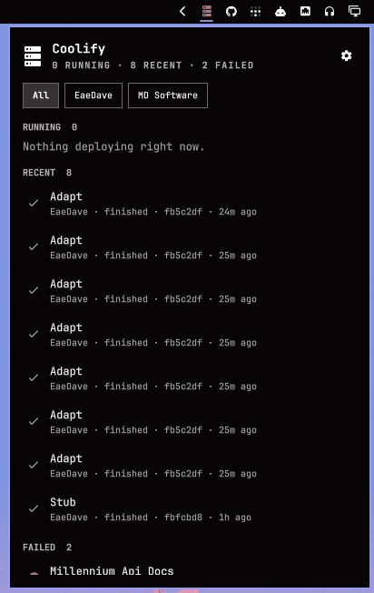

# Omarchy Coolify

Coolify deployments, on the Omarchy bar.

The icon lights up while something is deploying or a failed deployment has not been marked as seen. Click it for a panel of running, recent, and failed deployments.

One bar icon covers every Coolify you add. Name them in settings — Personal, Work, and so on — then filter the panel by that name.



## Install

Install directly from GitHub and enable the widget:

```bash
omarchy plugin add https://github.com/EaeDave/coolify-bar.git --enable
```

The widget defaults to the right side of the bar. To choose its position:

```bash
omarchy bar move eaedave.coolify
```

Confirm the installation:

```bash
omarchy plugin list | grep eaedave.coolify
```

### Update

```bash
omarchy plugin update eaedave.coolify
```

If your Omarchy version only supports updating all third-party plugins:

```bash
omarchy plugin update
```

### Remove

```bash
omarchy plugin remove eaedave.coolify
```

## Setup

1. In Coolify, switch to the team that has the apps, then **Keys & Tokens** → create a token with **read** (not `root`, not `read:sensitive`). The token only sees that team.
2. Click the Coolify icon on the bar (or it opens settings the first time).
3. Give it a **name** (Personal, Work…), the instance URL, and the bearer token.
4. **Add instance**. Repeat for another Coolify if you have more.

The token is stored on the widget entry in `~/.config/omarchy/shell.json`. That file is not a secrets store. Do not commit it.

## Controls

| Input | Action |
| --- | --- |
| Left click | Open or close the panel |
| Right or middle click | Refresh |
| Click a row | Open that deployment in Coolify |
| Tick in `FAILED` / `m` | Mark the highlighted failed deployment as seen locally |
| Gear | Settings |
| `j` / `k` or arrows | Move through rows |
| Enter / Space | Open the highlighted row |
| `r` | Refresh |
| Escape | Close |

The bar icon shows a count while deploys are running (`1`, `2`, `9+`). With more than one instance, chips at the top of the panel filter by name.

While a deploy is running, the helper polls about every 15 seconds. Otherwise it uses the interval from settings (default 30s).

Desktop notifications are enabled by default. You get one when a deployment is detected as active (running or queued), then another when it succeeds or fails. Events are deduplicated across bar instances, so multiple monitors still produce one notification.

Each deployment notification plays the bundled Coolify chime by default. Disable **Desktop notifications** to use the bar indicator only, or disable **Notification sound** to keep the toast silent.

A failed deployment stays red until you mark it as seen with its tick in `FAILED` (or `m` while it is highlighted). It then leaves `FAILED`, stays muted in `RECENT` when listed there, and no longer lights the bar. This acknowledgement is saved locally per Coolify source and deployment; it never changes data in Coolify.

Rows open through `omarchy-launch-webapp` by default. Switch **Open links** to **Browser tab** if you want them in a normal browser tab.

## Requirements

- Omarchy Quattro (Quickshell bar)
- `curl` and `jq`
- `omarchy-notification-send` (provided by Omarchy, for desktop notifications)
- `pw-play` (provided by PipeWire, for the Coolify chime)

## Local development

```bash
omarchy plugin validate .
tests/helper-test.sh
tests/notification-test.sh
tests/failure-acknowledgement-test.sh
omarchy plugin add "$PWD" --enable
```

The shell reloads QML when files under the installed plugin directory change.
For a linked checkout, run `omarchy restart shell` if the running shell keeps an older QML instance.

## License

MIT
